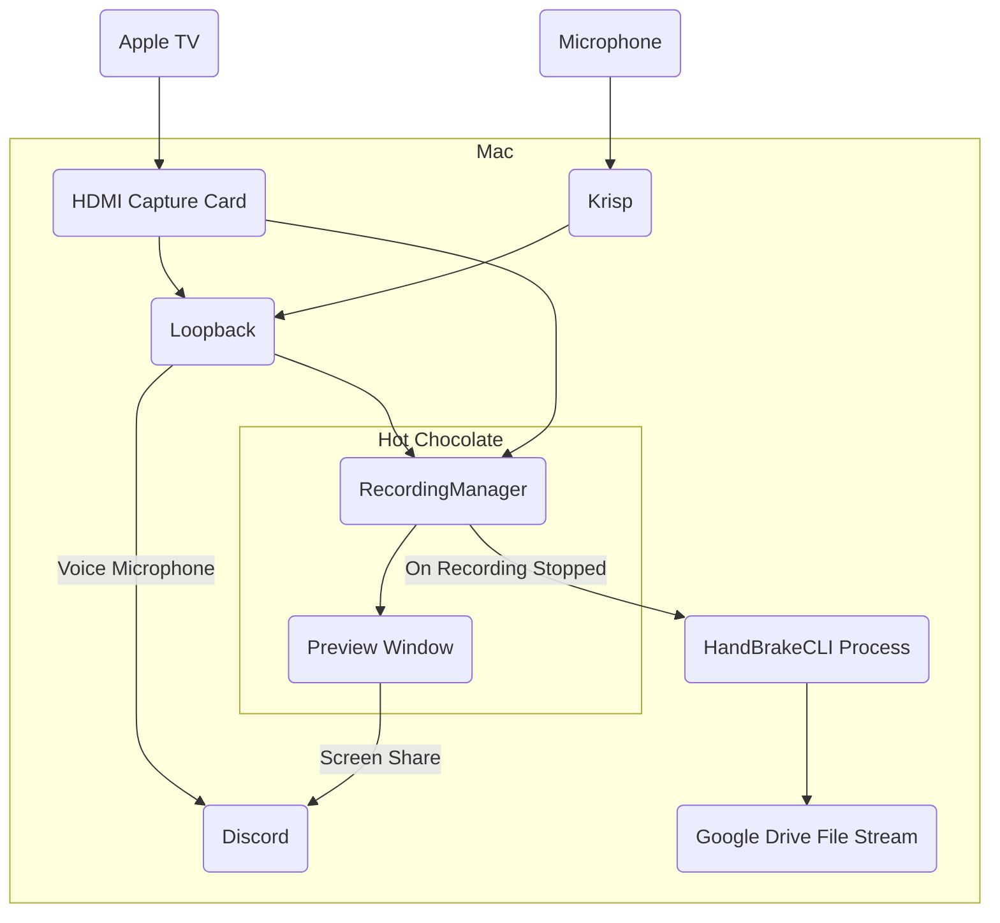

# hotchocolate
A recording set up for the Swift Accelerator Programme

```
H - Highly
O - Overengineered
T - Telecasting &
C - Capture
H - Hub
O - Offering
C - Compressed
O - Output
L - Leveraging
A - AirPlay
T - To
E - Effortlessly
S - Stream
```

I spent about 10 minutes on ChatGPT getting that name.

## What it does
1. Allow Apple TV to be connected to Mac.
2. Record the contents of the Apple TV (as well as any audio from the microphone and Apple TV).
3. Support screen sharing to Discord (to stream the class).
4. Compress any recordings using HandBrake.

## Cool images of the app
### Guided set up


### Presentation view


- There isn't much to it
- It's a button to start/stop
- A file name field
- A sidebar spamming logs so you know how badly (or well) things are going.

## Set Up
### Get a HDMI Capture Card
Yeah, do that. I personally use a Ugreen one that seems to be working pretty well.

### Install HandBrake CLI
As the executable path is hard-coded as `"/opt/homebrew/bin/HandBrakeCLI"`, it has to be installed via Homebrew.
```
brew install handbrake
```

### Install Loopback
Download [here](https://rogueamoeba.com/loopback/) (paid). 

It isn't strictly necessary but it makes it possible to pipe multiple microphones into the app's microphone, as well as to stream that over to Discord.

### Install Krisp
Download [here](https://krisp.ai/) (free, kind of, but you might need to pay). 

Once again, not strictly necessary but it comes in handy when teaching in a noisy classroom.

## How it works


