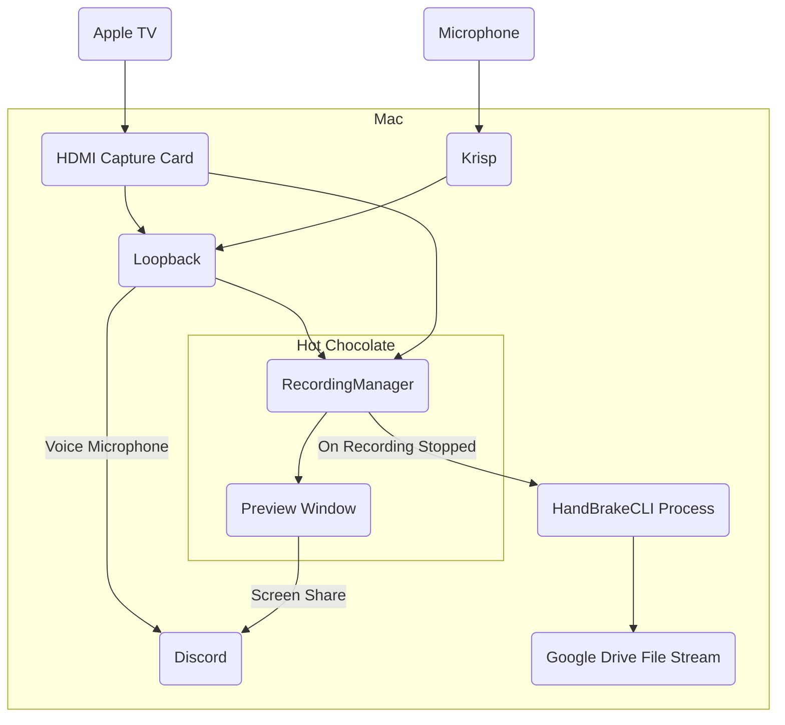

# hotchocolate
A recording set up for the Swift Accelerator Programme

```
H - Highly
O - Overengineered
T - Telecasting &
C - Capture
H - Hub
O - Offering
C - Compressed
O - Output
L - Leveraging
A - AirPlay
T - To
E - Effortlessly
S - Stream
```

I spent about 10 minutes on ChatGPT getting that name.

## What it does
1. Allow Apple TV to be connected to Mac.
2. Record the contents of the Apple TV (as well as any audio from the microphone and Apple TV).
3. Support screen sharing to Discord (to stream the class).
4. Compress any recordings using HandBrake.

## Set Up
### Install HandBrake CLI
As the executable path is hard-coded as `"/opt/homebrew/bin/HandBrakeCLI"`, it has to be installed via Homebrew or placed there after the fact.
```
brew install handbrake
```

### Install Loopback
Download [here](https://rogueamoeba.com/loopback/). 

It isn't strictly necessary but it makes it possible to pipe multiple microphones into the app's microphone, as well as to stream that over to Discord.

### Install Krisp
Once again, not strictly necessary but it comes in handy when teaching in a noisy classroom.

## How it works


